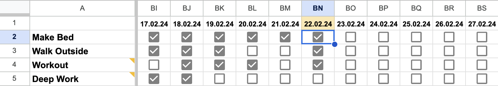
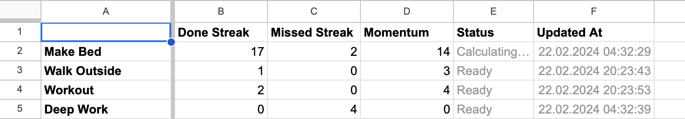

# Momentum Tracker

This is a Google Apps Script project that calculates a momentum score for your habits.

[](LICENSE)


_<p style="text-align: center">Input Sheet</p>_


_<p style="text-align: center">Overview Sheet</p>_

## Table of Contents

- [Usage](#usage)
- [Contributing](#contributing)
- [License](#license)

## Usage

If you use the same code, you'll need to create a Google Sheet with the same format.

1. Inside the spreadsheet, create two sheets:
   1. Input
      1. Column `A` contains `Habits`
      2. Row `1` contains `Dates`
   2. Overview
      1. Column `A` contains `Habits`
      2. Row 1 contains `Habit Attributes`
2. Go to `Extensions` => `Apps Script` and it'll create a new project for you.
   1. Go to settings and copy the Script ID of your project.
   2. Add the ID to your ENV under the name `SCRIPT_ID`.
      1. If you want to use a different name, you can configure this inside `generate-clasp-config.js`
   3. Run the `generate-clasp-config.js` to get your `.clasp.json` (clasp config) file.
3. Install the NPM packages.

## Building the project

This will output to files into the `build` folder:

1. A bundled version of all your code under `src/` into a single `index.js` file.
2. Generate `appsscript.json`

```
npm run build
```

## Pushing build to Apps Script

When you run this command, everything inside the `build` folder will be pushed to the project whose script ID you specified in the earlier steps.

```
npm run push
```

## Contributing

Hey, if you've got any cool ideas for fixes or improvements, send them my way in a quick note. I'm asking for short messages to keep things easy for you, especially if I'm caught up and can't reply. Thanks a bunch :)

## License

This project is licensed under the [MIT License](LICENSE).
